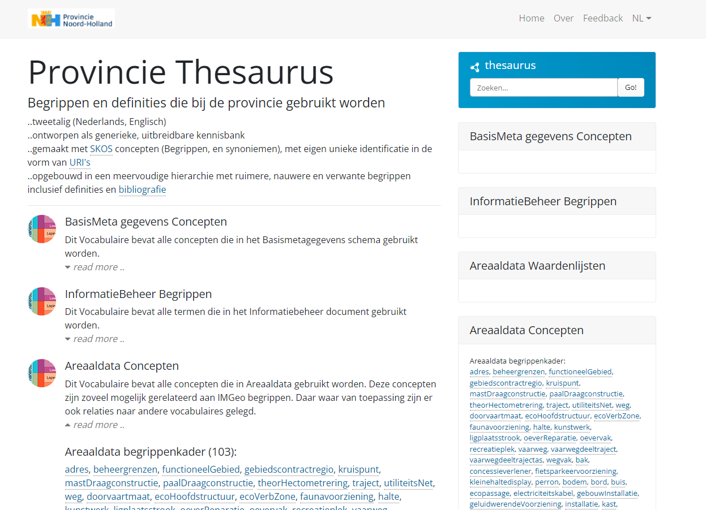
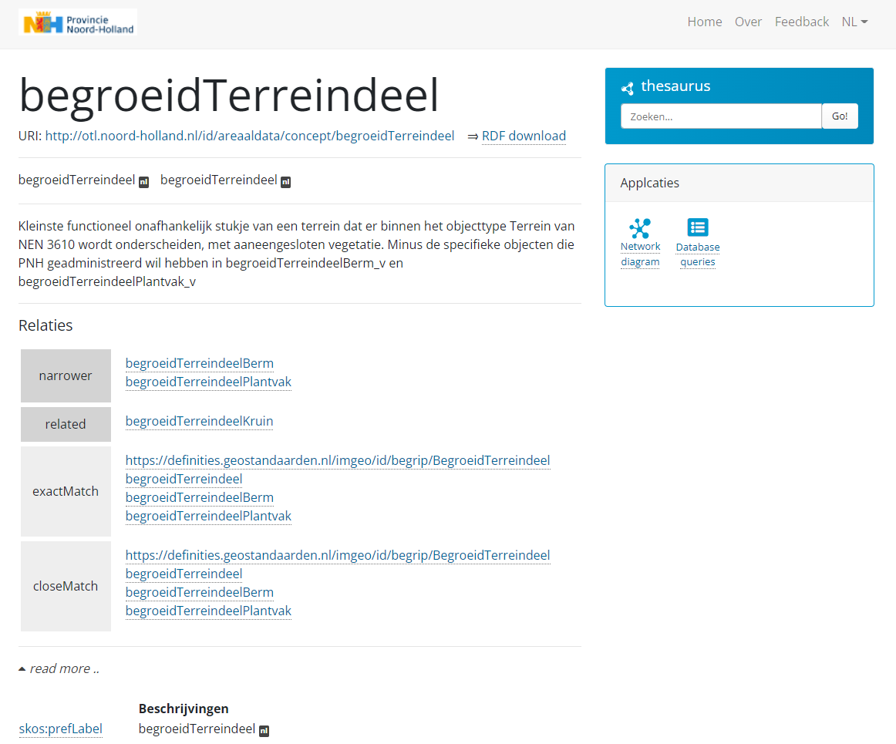
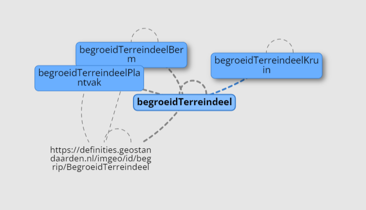

# Metadata Day 2022 - ShaclShenanigans
Repository for metadata day 2022 - Niels Hoffmann

### Governance as Code

Business Glossaries, KPIs, and Metrics: governing the intersection of technical data + business logic through code

[Proposal 1:](skos_2_glossary)
Ingest business glossaries from SKOS vocabularies. The dutch government publishes a lot of glossaries as SKOS vocabularies (e.g. https://definities.geostandaarden.nl/imgeo/nl/) I'd like to come up with an ingest recipe that imports the relevant business glossaries to Datahub so we can label our dataproducts according to national standards.

- see [skos_2_glossary](skos_2_glossary) folder

[Proposal 2:](shacl_table2terms)
Add functionality to a postgres ingestion script to match tables/columns to business glossary terms. For at least some of our postgres datasets we have SHACL based ontologies that refer to SKOS vocabularies for definitions. I'd like to come up with an ingestion script that uses our SHACL ontologies to map ingested data to business glossary terms.

- see [shacl_table2terms](shacl_table2terms) folder

[extra:](shacl_2_ge)
Convert SHACL constraints to Great Expectations validation suite.
Our 'business knowledge' is for a larrge part encoded in shacl profiles.
For different stages in the maturity of our datasets we have different profiles from ´lightweight' checking the basics, to full blown data quality requirements.
It'd be nice to use these validations on the database and show the results in de metadata catalog.

- see [shacl_2_ge](shacl_2_ge) folder (w.i.p.)

---

### Background

We have an ontology of our core assetmanagement information model, which is mapped to the National Base Registry of Topography (IMGeo/BGT)




Data is managed in our Postgis database and part of this data is provided to the national base registry, which is also available as knowledge graph:
https://data.labs.kadaster.nl/kadaster/bgt

Terminology is mapped to database tables using SHACL, using a sh:target statement to define the postgis table.

Besides the mapping SHACL is also used to define the constraints for the data
```
dprop:bak-BRONHOUDER a sh:PropertyShape ;
    adshapes:areaaldataversie "4.2" ;
    adshapes:begingeldigheid "2019-09-25"^^xsd:date ;
    sh:class adwl:bronhouder ;
    sh:maxCount 1 ;
    sh:minCount 1 ;
    sh:path adprop:BRONHOUDER .

adprop:bak-CREATED_DATE a sh:PropertyShape ;
    adshapes:areaaldataversie "4.2" ;
    adshapes:begingeldigheid "2019-09-25"^^xsd:date ;
    sh:datatype xsd:dateTime ;
    sh:maxCount 1 ;
    sh:path adprop:CREATED_DATE .

```
In this snippet you can see that BRONHOUDER is required, whereas Created_date is optional (but can only occur once). as well as the datatype being a domainvalue for BRONHOUDER and a datetime field for Created_Date.


---

