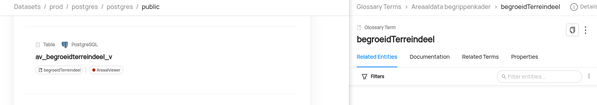

# SHACL table 2 terms

In the ontology shacl is used to define columns, constraints and a mapping to the database tables.

```
ad:bakShape a sh:NodeShape ;
    adshapes:areaaldataversie "4.2" ;
    adshapes:begingeldigheid "2019-09-25"^^xsd:date ;
    sh:property adprop:bak-AD_ID,
     ...
    adprop:bak-hasGeometry ;
    sh:target "av_bak_p" ;
    sh:targetClass ad:bak .
```
Because there is no formal way to map SHACL to database tables we got a little bit creative and decided to use sh:target 'by convention' to map to the database table name.

```
ad:bak a owl:Class ;
    rdfs:label "bak"@nl-NL ;
    ad:areaaldataversie "4.2" ;
    ad:begingeldigheid "2019-09-25"^^xsd:date ;
    ad:herkomstDefinitie "PNH" ;
    ad:isBGT_Object "Nee" ;
    ad:positioneleNauwkeurigheid "None" ;
    dcterms:subject adc:bak ;
    rdfs:subClassOf nta8035:PhysicalObject
    ...
```
sh:targetClass is used to map to the owl definition, which in turn points to the skos vocabulary via dcterms:subject.

```
adc:bak
  a skos:Concept ;
  adc:areaaldataversie "4.2" ;
  adc:begingeldigheid "2019-09-25"^^xsd:date ;
  dcterms:creator ... ;
  dcterms:description "Areaaldata versie: 4.2"@nl ;
  dcterms:modified "2019-09-25"^^xsd:date ;
  skos:definition "Object met een permanent karakter dat dient om iets in op te bergen of te verzamelen."@nl ;
  skos:exactMatch <https://definities.geostandaarden.nl/imgeo/id/begrip/Bak> ;
  skos:inScheme adc:Areaaldata ;
  skos:prefLabel "bak"@nl ;
  skos:topConceptOf adc:Areaaldata ;
.
```

See the jupyter notebook for the code to perform the mapping between tables and terms in datahub.

---
issues:
- for some reason mapping doesn't seem to work both ways all the time.
so e.g. a table has a mapped term, but the term does not show it's related enitities



Potential improvements:
- code is currently plenty 'hacky'
    - improve filtering for datasets
    - improve handling of term mapping between skos and datahub
    - ...

- might be nice to have a lineage map between entities and terms, or between terms and external mapping?
- Entities (tables) are related to an external knowledge graph -> would be nice to document that relationship somehow.